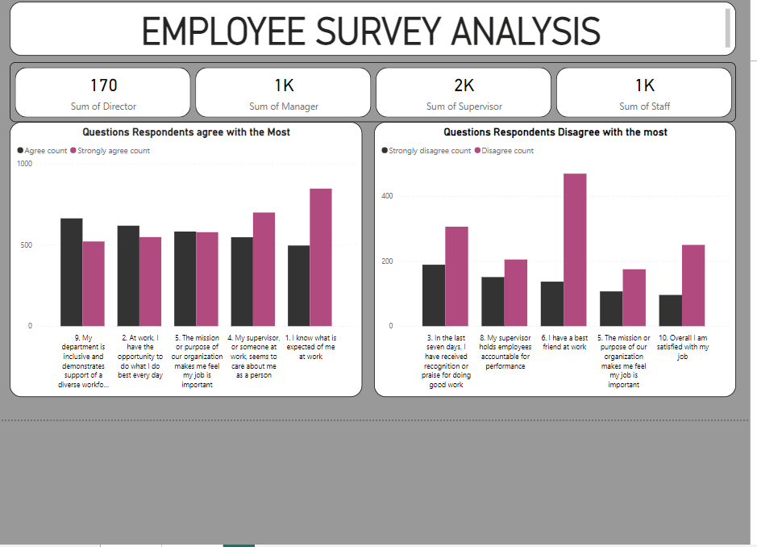
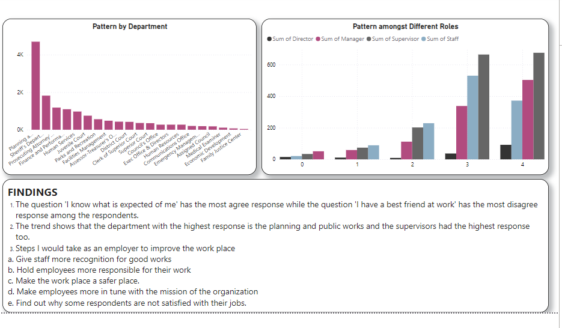

# EMPLOYEE-SURVEY RESPONSES

## INTRODUCTION
This is a power BI project on analysis of a group of Employee Responses. The Employee Survey Responses are actual responses from an employee engagement survey conducted
by Pierce County WA and completed voluntarily by government employees. The dataset is a Single table
and contains 14,725 records. The total number of fields is 10.

## PROBLEM STATEMENT

1. Which survey questions did respondents agree with or disagree with most
2. Do you see any patterns or trends by department or role?
3. As an employer, what steps might you take to improve employee satisfaction based on the survey
results?

## SKILLS
The following power BI features were incorporated;
Quick measures, filters, page navigation

## VISUALIZATION
This report comprises 2 pages

## ANALYSIS
Most of the staff are satisfied and happy with their job.
The most agreed upon question is "I know what is expected of me"
The most disagreed upon question is "I have a best friend at work".
